### 1 Fixed Function in Graphic Pipeline
#### 1.1 Rasterization

Addition formulas:

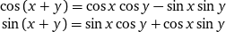

2D rotate matrix:

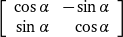

2D matrix to rotate a vector 90 degress counter-clockwise:

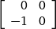

To judge vector v1 is pointing to the right side of vector v0:

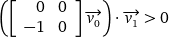

In OpenGL, default visiable triangles are counter-clockwise, thus left side of three edges form the triangle aera.

#### 1.2 Coordinate System Transform

Describe (u,v,w) space axis in (x,y,z) space:

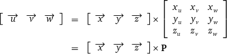

**P** converts a vector from (u,v,w) space to (x,y,z) space; Inv(**P**) converts a vector from (x,y,z) space to (u,v,w) space:

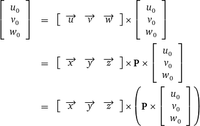

For points transformation:

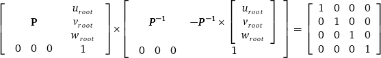

#### 1.3 Tangent Space

Triangle ABC in (x,y,z) space and (t,b,n) space:

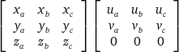

For 2 edges of the triangle:

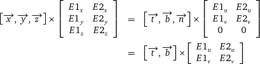

Then:

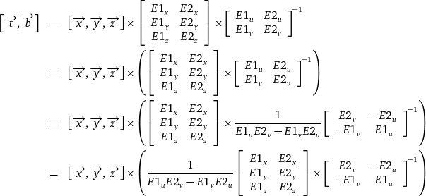

#### 1.4 Perspective Projection

In perspective projection, r,n,f[α, β] defines a frustum:

+ f: z of far plane
+ n: z of near plane
+ r: ratio of width to height of view wnidow
+ d: z of view window
+ α: view angle in the y axis direction
+ β: view angle in the x axis direction

In the y axis direction:

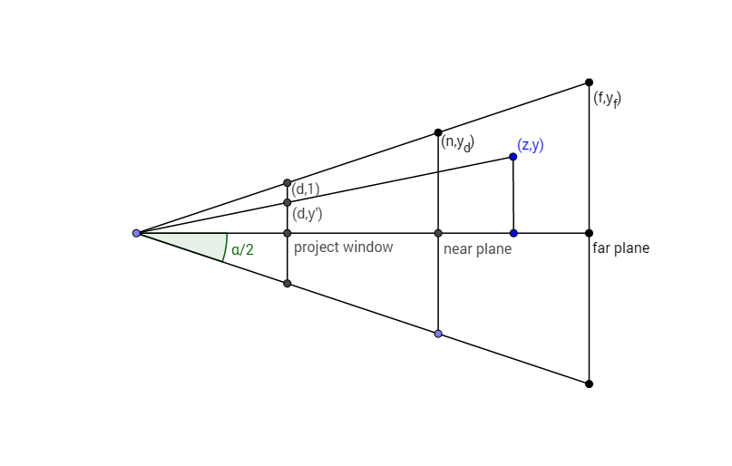

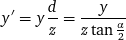

And in the x axis direction:

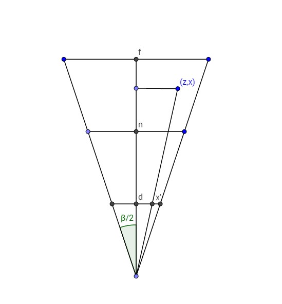

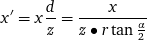

Put together:

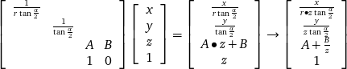

To make A+B/z 0 at near plane and -1 at far plane:

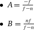

### 2 Linear Algebra
#### 2.1 Cross Product

Cross product definition differs in right-hand coordinate system and left-hand coordinate system ensuring that:

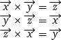

From this, it can be inferred that:

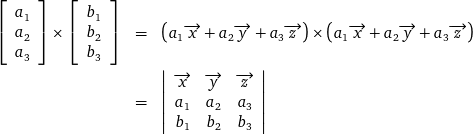
